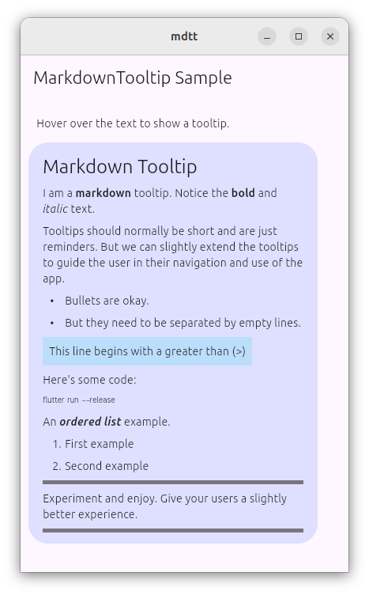
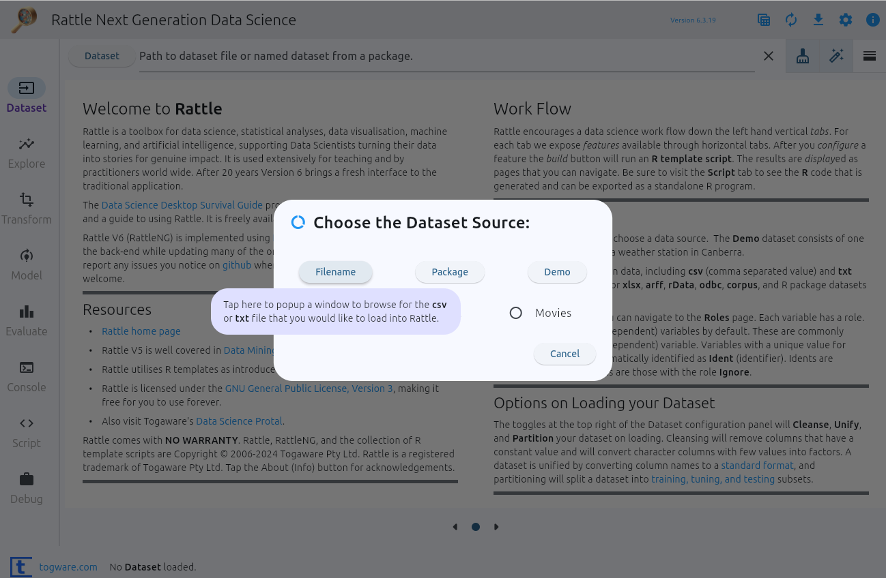

[](https://pub.dartlang.org/packages/markdown_tooltip)
[](https://flutter.dev/)
[](https://pub.dev/packages/markdown_tooltip)
[](https://github.com/gjwgit/markdown_tooltip/issues)
[](https://raw.githubusercontent.com/gjwgit/markdown_tooltip/main/LICENSE)

# Markdown Tooltips

A tooltip widget supporting Markdown and with a delayed popup by default.

Published through the Flutter repository as
https://pub.dev/packages/markdown_tooltip.

## Features

Tooltips are essential for self documenting apps which guide the user
through the app, without having to refer to  user manuals (if they
exist). The default Flutter Tooltip is quite plain, though
effective. This package adds support for Markdown within the tooltip.
It also introduces a delay by default to avoid clutter in instantly
popping up tooltips.

## Getting started

Simply add the package to your app by running the command:

```bash
dart pub add markdown_tooltip
```

Your `pubspec.yaml` will be updated to look like:

```yaml
dependencies:
  ...
  markdown_tooltip: ^0.0.2
```

## Usage

The `MarkdownTooltip` widget is used to wrap another widget for which
you would like a more flexible tooltip. In the below example of an
`ElevatedButton` the `Icon` child is wrapped with a `MarkdownTooltip`.

```dart
...
ElevatedButton(
    onPressed: ...,
    child: const MarkdownTooltip(
        message: '''

        **Save** Tap here to save our future. Visit *the
        internet* for details.

        ''',
        child: Icon(Icons.save),
    ),
)
```

## Additional information

The tooltip has a delay by default to avoid cluttering our apps.

You can contribute to this package and report issues through the
[github](https://github.com/gjwgit/markdown_tooltip) repository.

Text selection and URL links are not yet supported. Contributions are
welcome.

## Sample screenshots

The [example](example/lib/main.dart) app  provides a very simple
illustration of some possible markdown markup. To reproduce, simply
copy the example files then run `flutter create .` followed by
`flutter run`.



The [Rattle](https://github.com/gjwgit/rattleng) app, with its
front-end written in Flutter, utilises `MarkdownTooltip`s.  In this
simple example notice the use of bold to highlight the file types that
are permitted to be loaded into Rattle. Markdown will make bold any
text between `**` and `**`.


